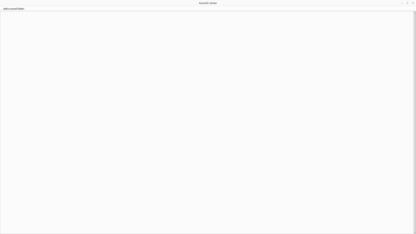

# Repository used for the paper A public benchmarking hydroacoustic dataset for geophonic signals detection task
This repository gives the code used to develop, train and evaluate detection models on *OHASISBIO-2018*, 
*OHASISBIO-2020* and *HYDROMOMAR-2013* datasets.
The project is made of several modules used to import and process the data and to create learning models. To use these
modules, several notebooks are proposed. In addition to this, a visual interface is proposed to enable an easy
visualization of the data.

## Requirements
This project was developed using Python 3.10.12. Libraries requirements are given in data/requirements.txt.
To run the code, please install Python 3.10.12, open a terminal at the root of the project and run the following:
```
pip3 install -r data/requirements.txt
```

The project dependencies and the GUI were also tested with Python 3.10.14. In case this version is required, consider running the following:
```
pip3 install -r data/requirements-3.10.14.txt
```

## How to run
### Data
To run the code of this project, acoustic data are necessary. Consider downloading the *OHASISBIO-2018* dataset, formatted
with .wav files named with a timestamp. The *OHASISBIO-2020* and *HYDROMOMAR* datasets are also available for download.
Once the download is finished, open the file **dataset.yaml** from *OHASISBIO-2018* folder, and modify the values 
of the fields **root_dir** to the paths of the datasets.

### Visualizing the data
A graphical software is made available with this project. This enables to quickly take a look at the data, by first
choosing a directory to inspect and then by exploring it with spectrograms. The following gif shows an example.

<p align="center">
  
</p>

To run this software, simply open a terminal in the **src** directory and run the following:
```
python3 -m GUI.main
```

Some shortcuts are available : 
* **+** or **-** enable to respectively zoom in or zoom out (dividing/multiplying the window length by two, 
keeping the same center).
* **left mouse click** enable to center a spectrogram on the given time instant.
* **left arrow** or **right arrow** enable to respectively move backward or forward in time, by half the window length.
* <b>*</b> or **/** enable to respectively decrease or increase the maximum displayed frequency.
* **up arrow** or **down arrow** enable to respectively decrease or increase the minimum and maximum displayed 
frequency together.
* **shift**+**enter** enables to format the other spectrograms as the one we focus on.
* **enter** enables to listen to the sound contained in the current window, with a x20 speedup for a better experience.

### Creating datasets
To create a dataset for training/evaluation, consider running a notebook. The directory
**src/notebooks/dataset_building** is purposely made for this task. Open the relevant notebook, modify the parameters
according to the needs and run the cells.

### Training and evaluating models
Directories **src/notebooks/detection/training** and **src/notebooks/detection/eval** were made to train and run the
models used in the paper. Open the relevant notebook, modify the parameters according to the needs and run the cells.
The directory **src/notebooks/detection/eval/figures_generation** enables to use the data produced by the evaluation
notebook to create figures.
